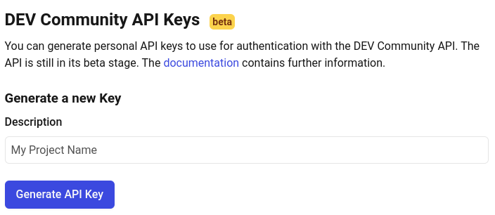
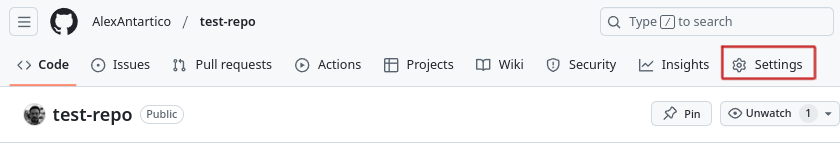
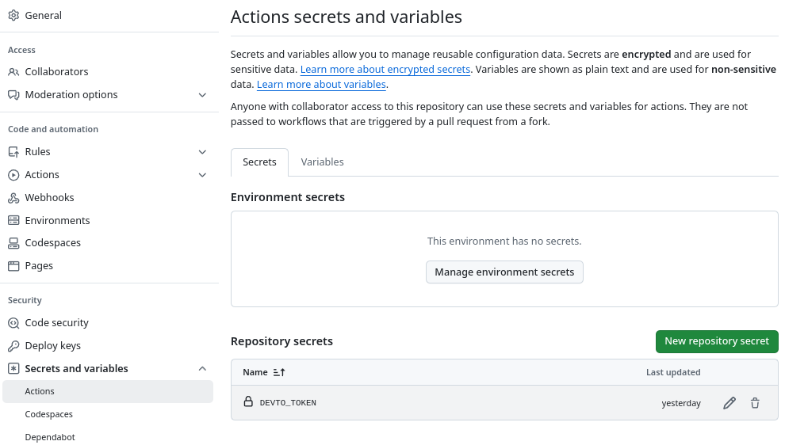

# How to upload Markdown files to Dev.to

This is a test post to show how to upload Markdown files to Dev.to.

You can do this with:
- GitHub actions
- Dev.to API Token
- GitHub Personal Access Token
- Publish to dev.to GitHub action

I am assuming you have a general knowledge with GitHub and actions, but you can achieve this with a superficial knowledge. To know more about it, you can check the [GitHub documentation](https://docs.github.com/en/actions).

## GitHub action to upload Markdown file

You can use GitHub actions to automate the process of uploading Markdown files to Dev.to. Using this action will make your life easier as every time you push a new commit to your repository, the markdown document will be pushed as well. There are already several actions available that can help you with this task or you can create your own action, but why reinvent the wheel?

I did some quick research and decided to use this [Publish to dev.to](https://github.com/marketplace/actions/publish-to-dev-to) GitHub action. It's simple to use and gets the job done.

First, fetch your DEV.TO API key. For this, log in to your DEV.TO account and go to settings/extensions, scroll all the way to the bottom and in you will see a section Named "DEV Community API Keys". Name your project and click on "Generate API Key". Copy this key and save it in your GitHub repository secrets.



To save the key as a secret. go to your repository settings, click on secrets, and add a new secret with the name `DEVTO_TOKEN` and paste the key you copied from DEV.TO.'





In your repository, create a new file called `.github/workflows/devto.yml` and add the following code that you can [find also at the action landing page in the GitHub marketplace.](https://github.com/marketplace/actions/publish-to-dev-to)

```yaml
steps:
- uses: actions/checkout@v4
- name: Publish articles on dev.to
  uses: sinedied/publish-devto@v2
  with:
    devto_key: ${{ secrets.DEVTO_TOKEN }}
    github_token: ${{ secrets.GITHUB_TOKEN }}
    files: 'posts/**/*.md'
    branch: main
    conventional_commits: true
    dry_run: false
```

So far, you have:

* Fetched your DEV.TO API key
* Saved it as a secret in your GitHub repository
* Created a new file in your repository .github/workflows/devto.yml
* Added the code above to the repository

To finalize, commit and push the changes to your repository, the action will run automatically and if everything is set up correctly; you will see your markdown file uploaded to DEV.TO.

Cheers and happy coding!

Eduardo M

